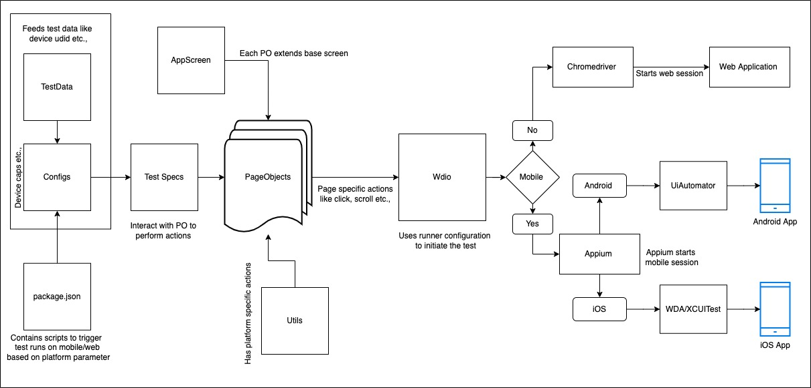

# **Test-Automation-Demo**

## **WebdriverIO + Appium Test Automation Framework**

A robust and scalable test automation framework designed for testing **Native Mobile Apps** (iOS and Android), **Mobile Web**, and **Desktop Web** applications.

---

## **Features**

1. Unified framework for testing web, mobile web, and native mobile applications.
2. Implementation of the **Page Object Model (POM)** for better code maintainability and reusability.
3. Modular design with reusable components for testing multiple platforms.
4. Comprehensive support for running tests on various devices and environments.

---

## **Setup Guide**

### **Prerequisites**

Before setting up the project, ensure the following are installed:

- **Node.js** (v16 or above recommended): [Download Node.js](https://nodejs.org/en/)
- **Appium**: Install globally using:
    ```bash
    npm install -g appium
    ```
- **Java Development Kit (JDK)**: Required for running Appium.
- An emulator, simulator, or physical device for mobile app testing.

### **Installation Steps**

1. Clone the repository:
    ```bash
    git clone <repository-url>
    cd <repository-folder>
    ```

2. Install project dependencies:
    ```bash
    npm install
    ```

3. Verify Appium installation:
    ```bash
    appium -v
    ```

4. Ensure the desired mobile app builds are available in the `apps/` folder for testing.
5. Ensure the ANDROID_HOME and JAVA_HOME environment variables are set correctly.
```bash
    export ANDROID_HOME=/Users/viet/Library/Android/sdk
   ```

6. Update the `config/wdio.shared.conf.js` file with the desired capabilities and configurations. These information must match with the emulator or real devices
```bash
    'appium:deviceName': 'emulator-5554',
    'appium:platformVersion': '15.0',
    'appium:automationName': 'UiAutomator2',
   ```
7. Start the Appium server:
    ```bash
    appium server --allow-insecure chromedriver_autodownload
    ```

---

## **Framework Overview**

### **Architecture**

Below is the high-level architecture of the framework:



### **Folder Structure**

- **`tests/specs`**: Contains test specifications for different scenarios.
- **`pageobjects`**: Houses Page Object classes for reusable interaction logic.
- **`helpers`**: Includes utility functions and helper scripts for various test operations.
- **`apps`**: Directory for mobile app builds (e.g., `.apk` or `.ipa` files).
- **`config/testData`**: Contains test data files required for the test cases.
- **`config`**: Includes WebdriverIO configuration and environment-specific setup files.

---

## **Run Options**

### Run Tests Locally

Execute tests locally using the following command:

```bash
npm run wdio
```

### Report Tests Locally
Execute tests locally using the following command:

```bash
npm run report
```